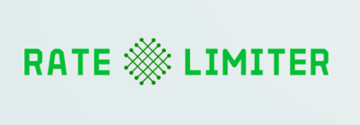

Traduções:

* [Inglês](README.md)
* [Francês](README_fr.md)

---

# 📶 Limitador de Taxa (rate-limiter)



Bem-vindo ao sistema de limitador de taxa desenvolvido em Go! Este projeto permite limitar o número de requisições por segundo com base em um endereço IP específico ou em um token de acesso.

## 📑&nbsp;Sumário

- [📖 Introdução](#introdução)
- [🛠 Pré-requisitos](#pré-requisitos)
- [⚙️ Instalação](#instalação)
- [🚀 Uso](#uso)
- [🔍 Exemplos](#exemplos)
- [🤝 Contribuição](#contribuição)
- [📜 Licença](#licença)

## 📖&nbsp;Introdução

Este sistema de limitador de taxa é um projeto desenvolvido em Go que permite limitar o número de requisições por segundo com base em um endereço IP ou em um token de acesso. Ele ajuda a controlar o tráfego para um serviço web de forma eficaz.

## 🛠&nbsp;Pré-requisitos

Certifique-se de ter os seguintes itens instalados antes de continuar:

- [Go](https://golang.org/doc/install)
- [Docker](https://www.docker.com/get-started)
- [Docker Compose](https://docs.docker.com/compose/install/)

## ⚙️&nbsp;Instalação

1. Clone este repositório:

    ```sh
    git clone git@github.com:rodrigoachilles/rate-limiter.git
    cd rate-limiter
    ```

2. Execute o Docker Compose:

    ```sh
    docker-compose up -d
    ```

## 🚀&nbsp;Uso

Após iniciar o Docker Compose, você pode configurar e usar o limitador de taxa.

### 🔧&nbsp;Configuração

1. Crie um arquivo `.env` na raiz do projeto com as seguintes configurações:

    ```env
   SERVER_PORT=:8080
   REDIS_ADDR=redis:6379
   LIMITER_IP_LIMIT=10
   LIMITER_TOKEN_LIMIT=100
   LIMITER_BLOCK_TIME=300 # segundos
    ```

2. Execute o servidor Go:

    ```sh
    go run main.go
    ```

### 📚&nbsp;Middleware

Para usar o middleware do limitador de taxa, adicione-o ao seu servidor HTTP:

```go
package main

import (
   "net/http"
   "rate-limiter/middleware"
   "log"
   "time"
   "context"
   redis "cloud.google.com/go/redis/apiv1"
)

func main() {
	cfg, err := config.LoadConfig()
	if err != nil {
		log.Fatalf("failed to load config: %v", err)
	}

	ctx := context.Background()
	client, err := redis.NewCloudRedisClient(ctx)
	if err != nil {
		log.Fatalf("failed to create redis client: %v", err)
	}
	defer client.Close()

	l := limiter.NewLimiter(client, cfg.IPLimit, cfg.TokenLimit, cfg.BlockTime)

	mux := http.NewServeMux()
	mux.HandleFunc("/", func(w http.ResponseWriter, r *http.Request) {
		w.Write([]byte("Hello, World!"))
	})

	handler := middleware.RateLimiter(l)(mux)

	srv := &http.Server{
		Handler:      handler,
		Addr:         "0.0.0.0:8080",
		WriteTimeout: 15 * time.Second,
		ReadTimeout:  15 * time.Second,
	}

	log.Println("Server is running on port 8080")
	log.Fatal(srv.ListenAndServe())
}
```

## 🔍&nbsp;Exemplos

Aqui estão alguns exemplos de uso do limitador de taxa:

- Limitar o número de requisições por segundo com base em IP.
- Limitar o número de requisições por segundo com base em um token de acesso.
- Bloquear novas requisições após exceder o limite por um tempo especificado.

## 🤝&nbsp;Contribuição

Sinta-se à vontade para abrir issues ou enviar pull requests para melhorias e correções de bugs.

## 📜&nbsp;Licença

Este projeto está licenciado sob a Licença MIT.
